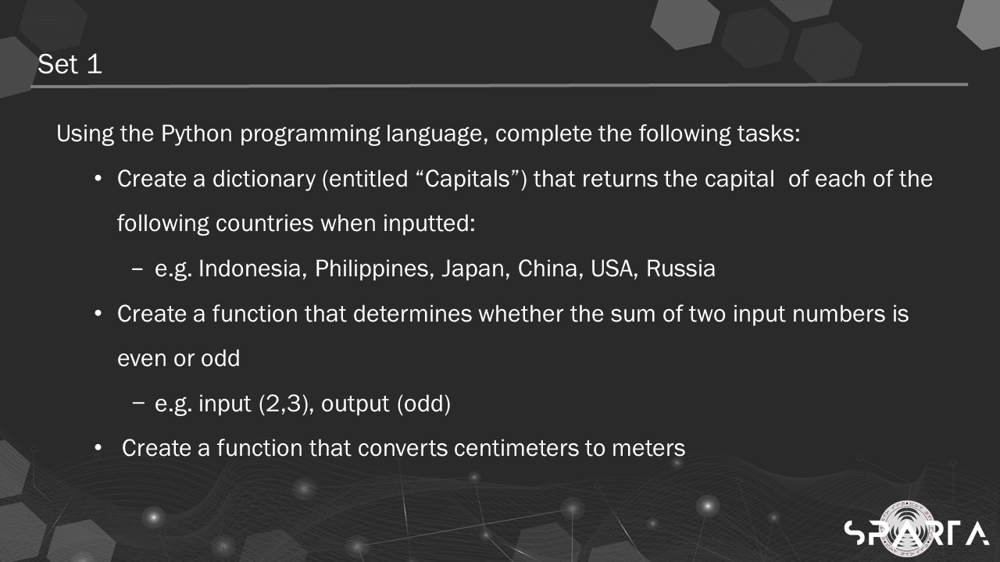

# Creating a Function

### Objective
- Our exit assessment for this week is an exercise on using the data structures, python statements, and defining/creating functions.

### Solution
- Here is my solution to the assessment. [Creating a Function](https://github.com/cancinoray/python-for-data-engineering-SPARTA/blob/main/01-creating-a-function/Creating%20a%20Function.ipynb)
