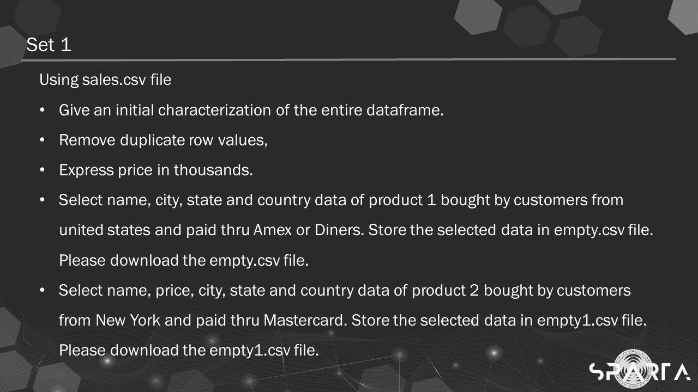

# Data Processing Part 1

### Solution
- Here is my solution to the assessment. [Data Processing Part 1](https://github.com/cancinoray/python-for-data-engineering-SPARTA/blob/main/03-data-processing-part1/Cancino_PreprocessingP1_Week3.ipynb)
